# Different approach for algorithms and data structure implementation

​		**group name: **Oreo

​		**group members: **Liang Ziyi , Liu Yixuan

​		**laboratory work number: **7

​		**variant description：**Dictionary based on hash-map (collision resolution: separate chaining）

## Problem Description

In this laboratory work, we should develop a library for a specific data structure. Wu should  implement the selected data structure in two way:

+ as a mutable object (interaction with an object should modify it if applicable)
+ as an immutable object (interaction with an object cannot change it).

## Introduction and verification of function realization

##### Mutable

The functions of **mutable dict** are as follows：

+ get_value

  We get the position of the known number in the hash map by integer remainder method.

  

+ add

  First, we get the position in the hash map through the key value, and then add it to the hash map. We solve the key value conflict through the linked list. At the same time, you need to increase the size of the table

  

+ remove

  Similarly, the key value is used to find its position in the hash map, search in the linked list of the position, and judge whether it exists. If it exists, delete it and return true. If it does not exist, return false.

  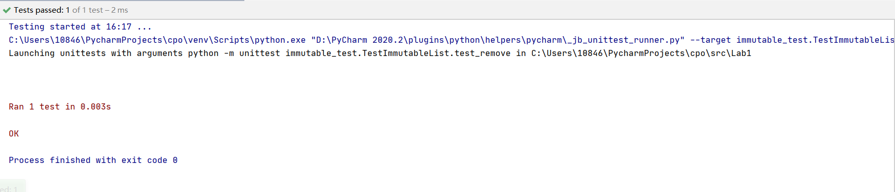

+ find

  We find element in hash map by key.

  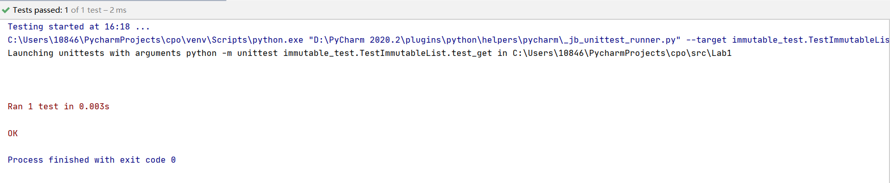

+ remove_key_set

  We remove element in hash map by key. At the same time, we increase the size of the table.

  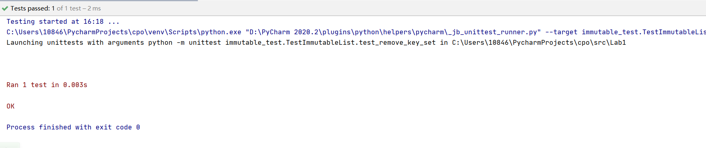

+ from_dict

  Convert dictionary to hash map.

  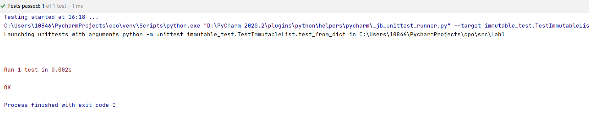

+ to_dict

  First, an empty dictionary is created, and then the elements in the HashMap are stored in the dictionary in the form of key value pairs.

  

+ get_size

  We can get the size of hash map by this function.

  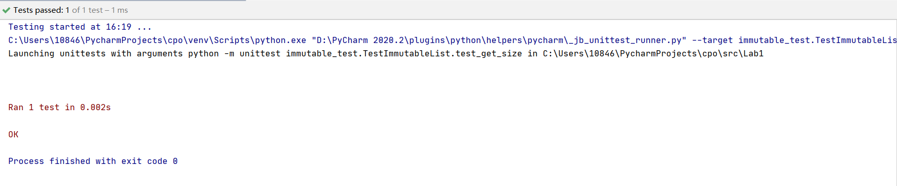

+ to_list

  transfer hash map into list type.

  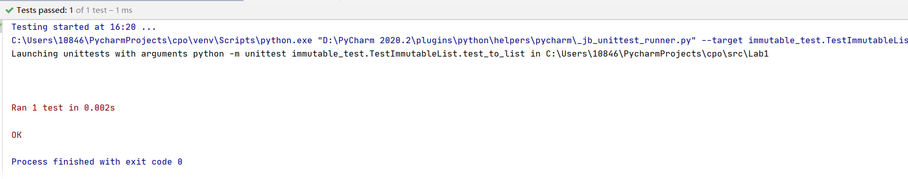

+ from_list

  This function realizes the function of adding data in the form of array to the dictionary.

  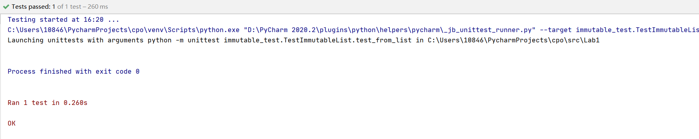

+ find_iseven

  We can use this function to determine whether there is an even number in the hash map. If there is, we will return the result set in the form of list.

  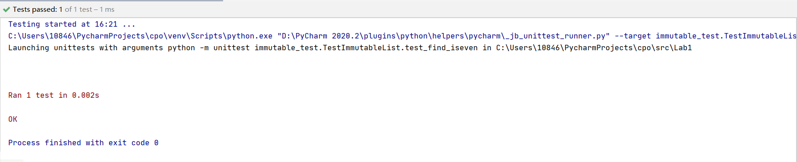

+ filter_iseven

  Traverse hash map, and then judge whether it has even number. If there is even number, delete it. If there is no even number, ignore it. Finally, return the processed result set.

  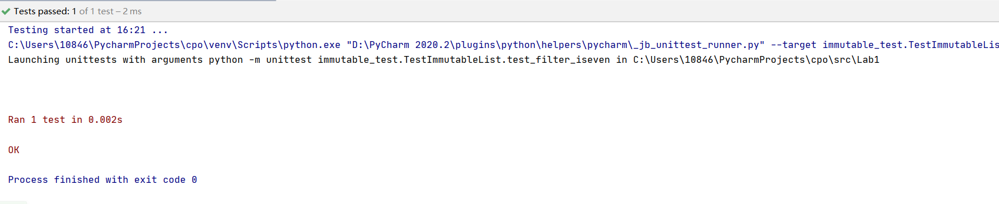

+ map

  This function can map the element values in hash map with f.

  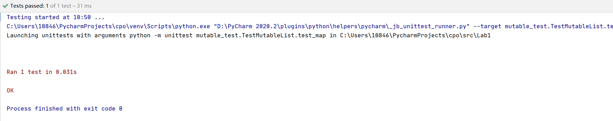

+ reduce

  build a return value by specific functions(f)

  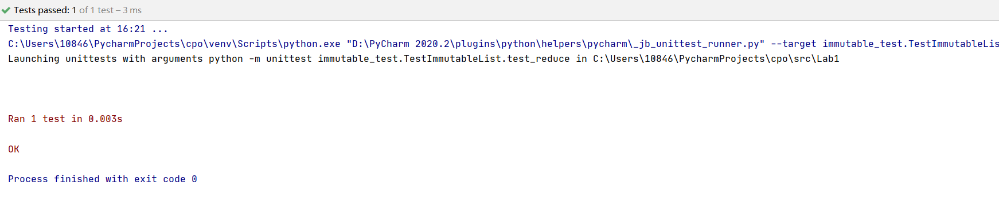

+ iter

  This function is used to access an iteratable sequence.

  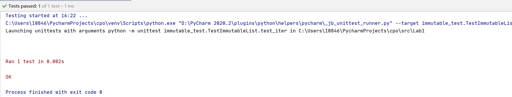

+ mempty

  This function returns None.

+ mconcat

  Judge whether one of the two incoming objects is none, and return none. If both objects are not empty, return the union of them.

  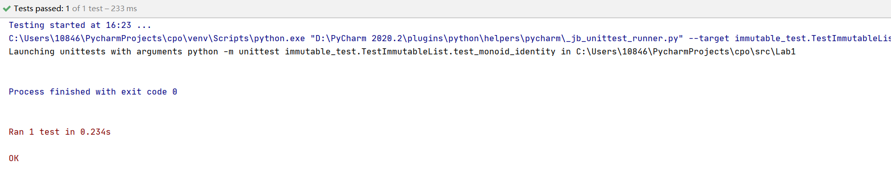

  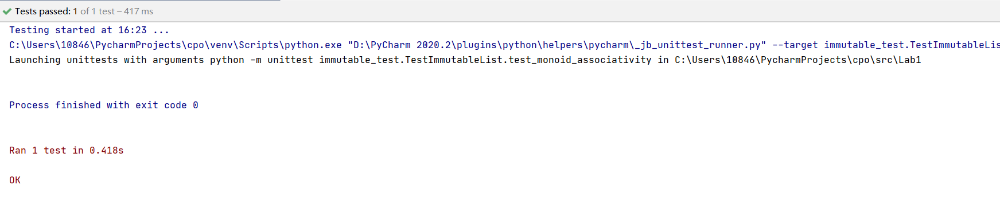

##### Immutable

+ get_value

  Return value by key.

  

+ add

  insert key-value pairs into hash map

  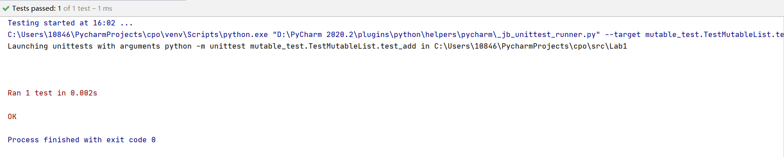

+ remove

  remove element in hash map by key.

  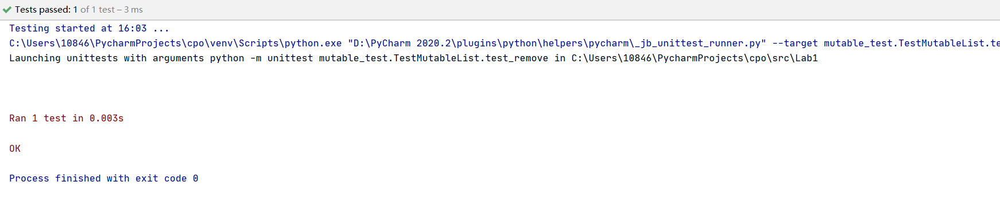

+ find

  find element in hash map by key.

  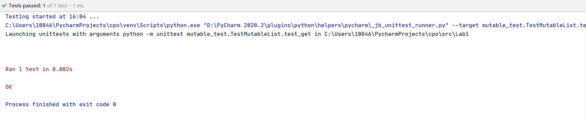

+ remove_key_set

  Delete a key in hash map.

  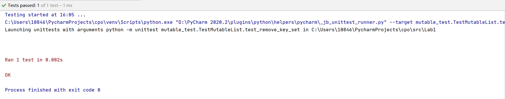

+ from_dict

  Convert dictionary to hash map.

  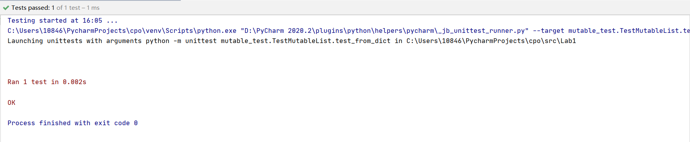

+ to_dict

  transfer hash map into dict

  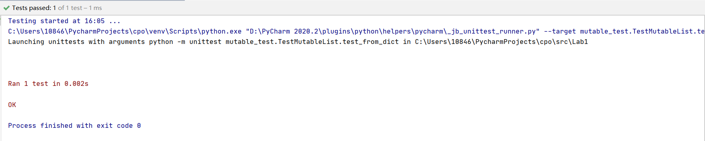

+ get_size

  get the number of element in hash map

  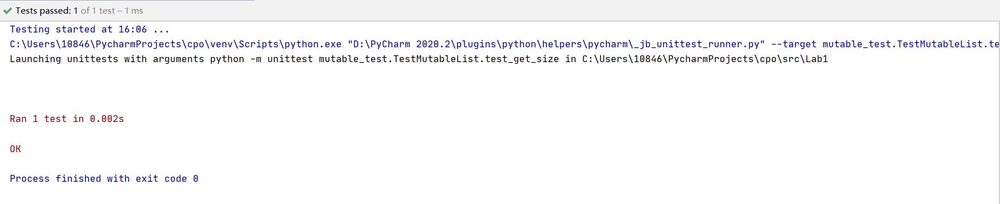

+ to_list

  transfer hash map into list type.

  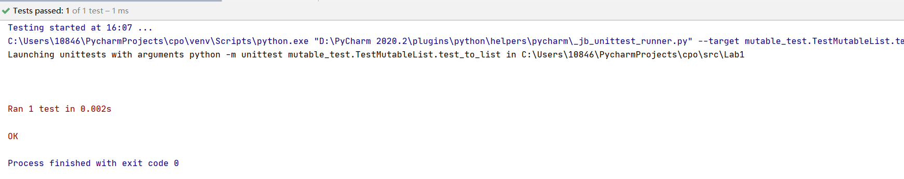

+ from_list

  add element from list type.

  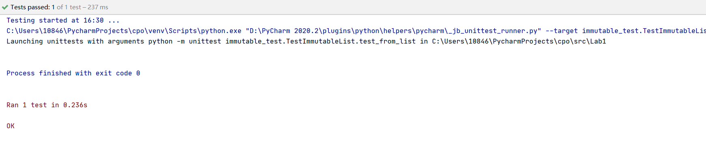

+ find_iseven

  find element with even value in hash map.

  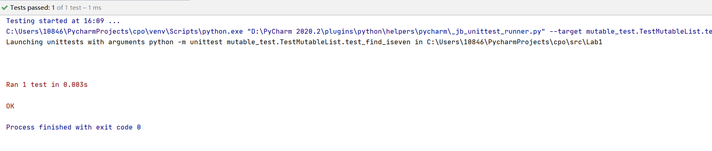

+ filter_iseven

  filter element with even value in hash map.

  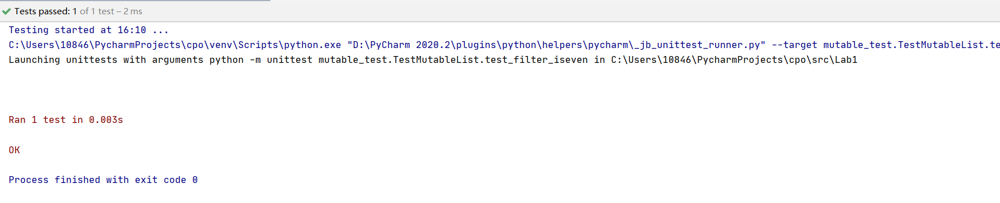

+ map

  map element value in hash map with f

  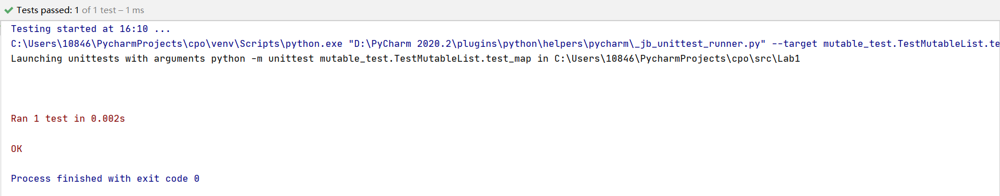

+ reduce

  build a return value by specific functions(f)

  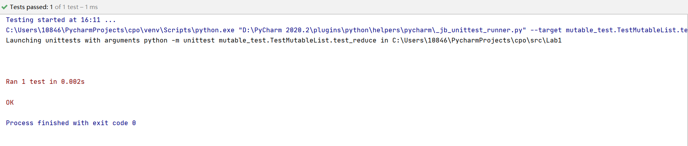

+ mempty

  return a none value.

+ mconcat

  Judge whether one of the two incoming objects is none, and return none. If both objects are not empty, return the union of them.

  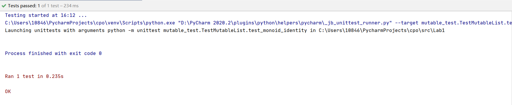

  

+ iterator

  This function is used to access an iteratable sequence.

  

## Contribution Summary

Liang completed the data structure design and code writing. Liu completed data testing and documentation.

## Conclusion

In this experiment, we completed the design and implementation of the dictionary based on hash map (changeable and immutable). The mutable object can be changed after it is created, and the address will not change at the same time. The opposite is true for immutable objects. After the object is created, it cannot be changed. Once the address is changed, the variable points to a new object.

We realize the functions of adding, deleting, modifying, checking, size, structure conversion and many more. This experiment deepened our understanding of python and data structure.
